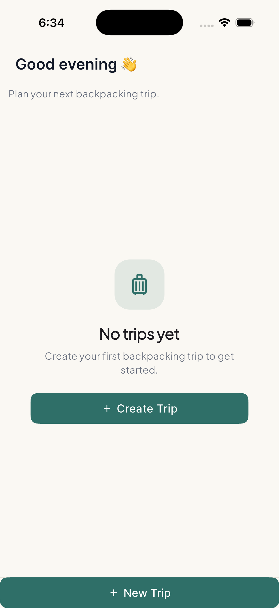
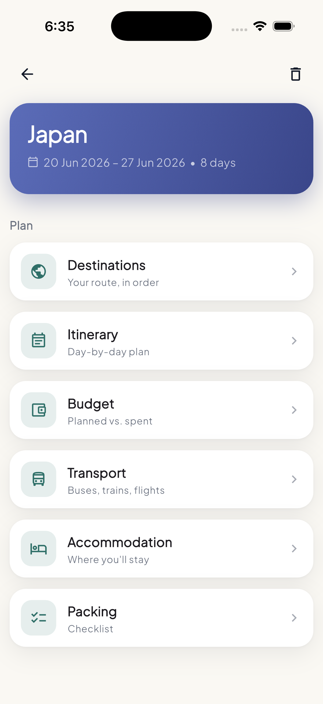
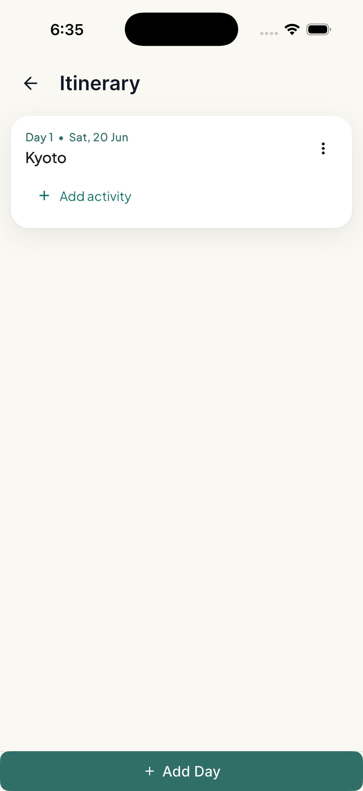
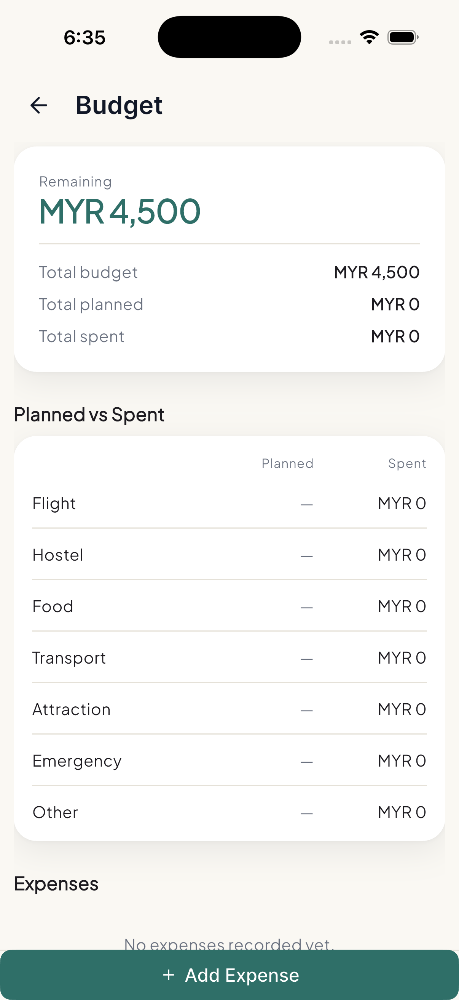
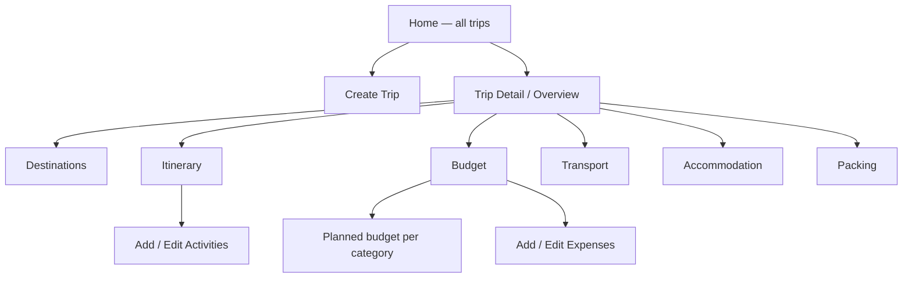
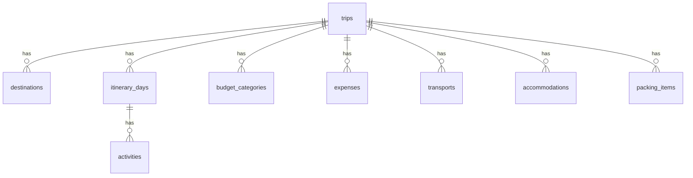

# TripPacker

> An offline-first backpacking trip planner built with Flutter — organize your
> route, itinerary, multi-currency budget, transport, accommodation, and packing
> checklist in one app, with everything stored locally on device.


## Preview

| Home | Trip Overview | Itinerary | Budget |
| --- | --- | --- | --- |
| |  |  |  |

## About

TripPacker is designed for solo backpackers and budget travellers who plan trips
across multiple countries on buses, trains, and budget flights. Instead of
juggling Google Sheets, Notes, screenshots, and chat messages, it keeps the
important travel-planning details in one clean, offline-first app.

**Example user:** a Malaysian solo backpacker travelling from Istanbul through
the Balkans, staying in hostels, using buses, and tracking the full trip budget
in MYR with mixed-currency expenses.

The project is built for learning, portfolio, and personal backpacking use, with
an emphasis on clean Flutter architecture and a proper relational local database.

## Features

- Create and manage trips
- Plan an ordered route of destinations (drag to reorder)
- Plan a day-by-day itinerary with timed activities (timeline view)
- Track travel expenses with multi-currency support (exchange rate to base)
- Planned-vs-actual budget by category
- Manage transport legs (bus, train, flight, ferry, metro, walk)
- Manage accommodation bookings (hostel / hotel)
- Packing checklist with progress and category filter
- Offline-first local database with cascade deletes
- Consistent UI: tap a card to edit, swipe to delete
- Light/dark theming, feature-based architecture

## Tech Stack

| Area | Choice |
| --- | --- |
| Framework | Flutter |
| Language | Dart |
| State management | Riverpod |
| Navigation | GoRouter |
| Local database | Drift (SQLite) |
| UI / design system | Forui + Material |
| Typography | Google Fonts (Plus Jakarta Sans) |
| Formatting | intl (dates & currency) |
| Testing | flutter_test + mocktail |

## System Flow



All trip data lives in a single on-device Drift/SQLite database. Screens read
live data through Riverpod stream providers, so any edit updates the UI
immediately — no manual refresh, no network round-trips.

## Database Overview

Nine tables, all trip-scoped. Every child table references `trips.id` (or
`itinerary_days.id` for activities) with `ON DELETE CASCADE`, and foreign keys
are enforced via `PRAGMA foreign_keys = ON` — so deleting a trip cleanly removes
all of its data with no orphaned rows.



| Table | Purpose |
| --- | --- |
| `trips` | Trip title, dates, base currency, estimated budget, notes |
| `destinations` | Ordered route of countries/cities (`orderIndex`) |
| `itinerary_days` | A dated day within a trip |
| `activities` | Activities under a day (optional time, location, cost) |
| `budget_categories` | Planned budget per category |
| `expenses` | Actual spend, with `currency` + `exchangeRate` to base |
| `transports` | Legs (type, from/to, departure/arrival, cost, ref) |
| `accommodations` | Bookings (name, city, check-in/out, cost, ref) |
| `packing_items` | Checklist items (category, `isPacked`) |

> Money is always summed in the trip's base currency as
> `amount × exchangeRate`, so mixed-currency expenses total correctly.

## API Endpoints

TripPacker is **offline-first and has no backend or network API** — all data
stays on device. The equivalent "API" is the local data-access layer: one
repository per feature wrapping Drift queries, exposed to the UI as Riverpod
providers.

| Repository | Key operations |
| --- | --- |
| `TripRepository` | watch all / by id, create, update, delete (cascades) |
| `DestinationRepository` | watch, add, update, delete, `persistOrder` (reorder) |
| `ItineraryRepository` | watch days/activities, add, update, delete |
| `BudgetRepository` | `setPlanned` (upsert), expense CRUD, watch |
| `TransportRepository` | watch (by departure), add, update, delete |
| `AccommodationRepository` | watch (by check-in), add, update, delete |
| `PackingRepository` | watch, add, `setPacked` toggle, update, delete |

> A cloud API (e.g. Laravel) and sync are planned post-V1 — see
> [Future Improvements](#future-improvements).

## Getting Started

**Prerequisites:** Flutter SDK (with Dart) installed and a device/emulator.

```bash
# 1. Install dependencies
flutter pub get

# 2. Generate Drift database code (*.g.dart)
dart run build_runner build --delete-conflicting-outputs

# 3. Run the app
flutter run

# Run the tests
flutter test
```

Tests cover the business logic: repository CRUD + cascade deletes (Drift
in-memory), budget calculations (totals, exchange-rate conversion, remaining),
Riverpod provider/state wiring, and widget tests for key screens.

## What I Learned

- Designing a **relational local database** with Drift — typed tables,
  foreign keys, and `ON DELETE CASCADE` for clean, orphan-free deletes
- Structuring a **feature-based Flutter architecture** (data / providers /
  screens / widgets) that scales across many modules
- Reactive UI with **Riverpod stream providers** backed by Drift's `watch`
  queries — edits reflect instantly with no manual refresh
- Handling **multi-currency money** correctly by storing an exchange rate and
  always totalling in a single base currency
- Building a **design system** (shared card, scaffold, theming) and a consistent
  interaction model (tap to edit, swipe to delete)
- Writing meaningful tests — repository, calculation, provider, and widget tests
  with in-memory databases and mocktail

## Future Improvements

- [ ] AI itinerary generator (Gemini API)
- [ ] AI packing-list generator
- [ ] Auto currency conversion (live exchange rates)
- [ ] Cloud sync + accounts (Laravel API / Supabase)
- [ ] PDF trip export
- [ ] Map integration
- [ ] Attach booking screenshots
- [ ] Push notification reminders

## License

Built for learning and portfolio purposes by [syahmidev](https://www.syahmidev.com).
